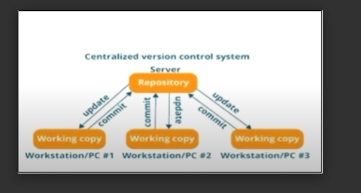
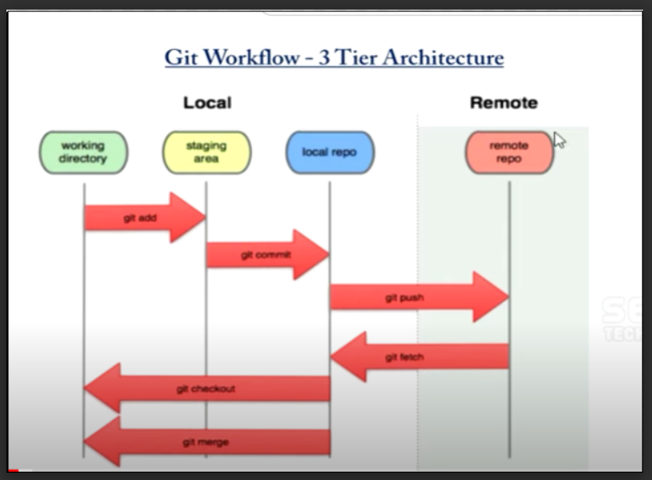

# WHAT IS GIT

Git is a version controlling system which helps for following: Traceability of code, Increase the productivity & Collaborate all developers.

Which is also called Version Control system(VCS) , Revision Control system(RCS) & Source Code management.

# Types of GIT:

1. Local VCS --- Which is something manage in our laptop.

2. Centralized VCS ---- Which helps for developers commit the code in same server.(Note: commit is nothing but to update the code in server)

Refer the images below Centralized VCS:

3. Distributed version Controlling System ----- Which helps for Store the Repositories in their local repository and commit in the server, So all Threads and issues can find out Local repo itself production doesn’t affect. Compare to the CVCS and DVCS is more powerful. ( It holds multiple repositories)

Refer the image below Distributed VCS:

List Of VCS: GIT, SVN, Clear case, Mercurial, TFS, Helix-core ( Git is a distributed version control system.)

Git is very popular one and it is developed in 2005. Linus Torvalds is the owner of the Git.

# GIT FEATURES:

1. Work on a Distributed System.

2. Compatible with all OS.

3. Allows Non-Linear Development.

4. Branching

5. Fast as a Flash

6. Reliable.

# GIT WORKFLOW:

Refer the image below for Git Work Flow:

