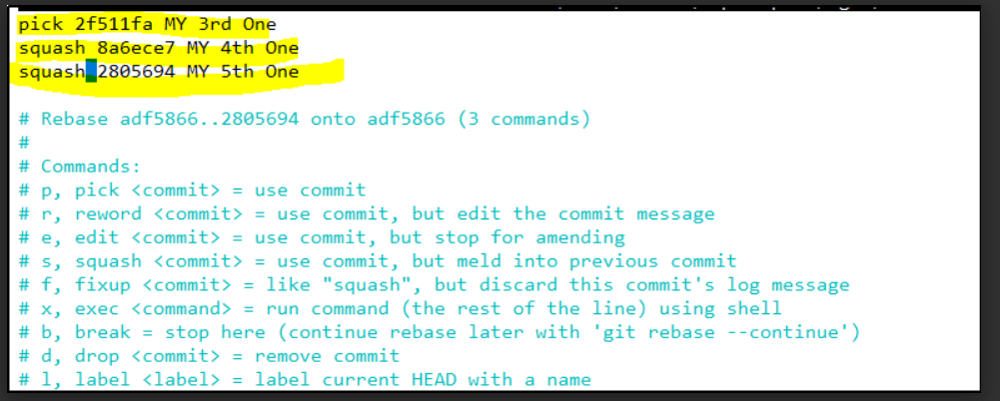

# Git Squash:

Git squash used to merge the multiple commits into the single commit.(It affects complete history, So without approval of the manager should not do this)

Note: After squash the multiple commits, We should not remove the particular commit from the squash, Once you squashed that’s it.

Steps:

Here 5 Commits are already done.

```
touch 1
git add.
git commit -m "my First one"
```
Etc…

ubuntu@ip-172-31-38-102:~/squashprac$ git log --oneline

2805694 (HEAD -> master) MY 5th One

8a6ece7 MY 4th One

2f511fa MY 3rd One

adf5866 MY 2nd One

f5b034b my First one

Now I want to squash them into single commit.

```
git rebase -i HEAD~[5]  
```
Here 5 commits are only present, So we can easily count and use the command but in real time we can squash by using commit number.

```
git rebase -i adf5866 
```

After run the command the below screen will pop up.

Refer the link:


In the above screenshot , We must change the pick to squash like below. First line you should not replace, If you replace, It throws a error.

Refer the link:



Press Ctrl+o and Enter and Ctrl+x and then it asks a comment to squash, Just give the commend and come out by Pressing shift+y.

Final output:

ubuntu@ip-172-31-38-102:~/squashprac$ git log --oneline

1d8c2be (HEAD -> master)  This is a combination of 3 commits.

adf5866 MY 2nd One

f5b034b my First one

