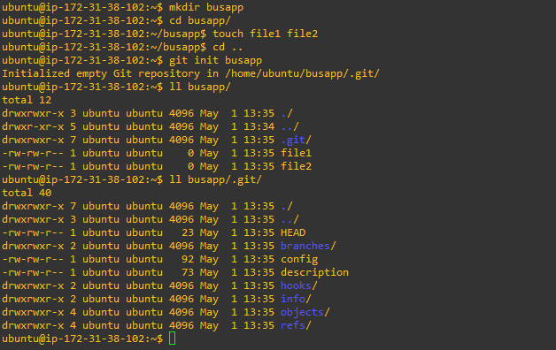

# GIT Initialization(Adding Folder into GIT):

```
mkdir /busapp
cd /busapp
touch file1 file2
cd ..
git init busapp
```

Busapp is our project and git init busapp command used to get in the busapp folder into the VCS(version control system)

If we ran the command it creates a .git dir inside the busapp.

Refer the Image Below:



# Move Files from Working Dir to Staging:

The following command used to get in the all files from working directory to staging area: 

```
git add .
```
The following command used to get in the particular files from working directory to staging area: 

```
git add file1 
```
(Here file1 only goes from Working directory to staging area)

# Check the status:

The below command gives all front end and back end commands & it lists untrack files too ( Which means some files not added into staging)

```
git status
```

Refer the Link below:


# To revert the file from staging to Working directory :

```
git rm --cached file1
```

Note :If you run the "git sttaus" command it doesn't shows any untrack files.Because We reverted the file from Saging to Working directory.


# Commit From Staging to Local Rep:


```
Git add file1
Git commit -m “file1 Added”
Git status
```

Note: Now the comamnd "Git status" Doesn't Shows any info about file1 becuase it has been committed.

Refer the image below:


Again add some lines in file1 and check "git status", it shows the modified details.

Refer the link:


# Restore the Modified File into old state:

```
git restore file1
```

Now checke the " git status" It doesn't shows anything about file1 modifications.

Refer the link:


Again add some stuff in file1 and then commit the file use the commands:

Refer the link:


Again create two files using touch and move them into staging and Local repo from working directory.

```
touch file3 and file4
Git add file3 file4
Git commit -m “File3 and file4 Added”
```

Refer the link:


