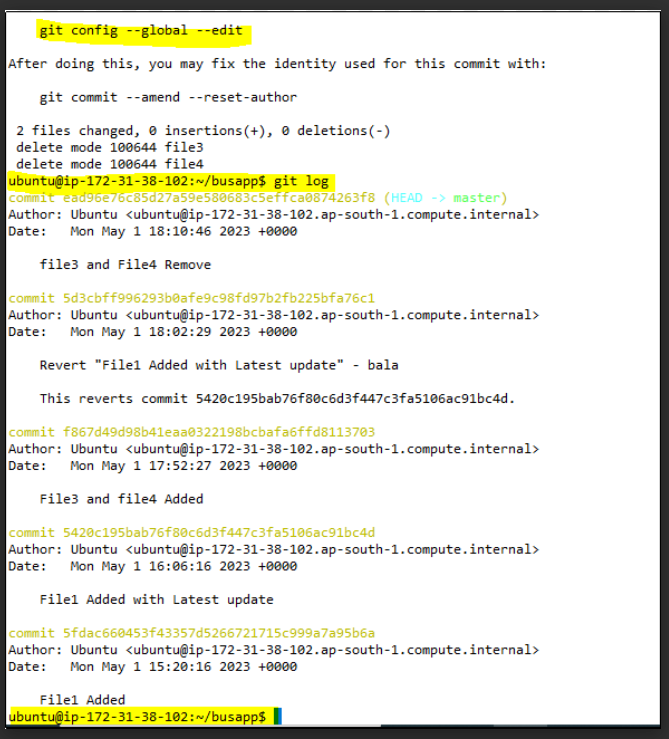

# Git Log

```
git log
```

The command helps us to view the all commit details. Which is very useful for revert the changes using commit id's.

"git log" commands shows a detail info. but the "git log --oneline" command shows the short description.

Refer the Link:


# Git Reset:

It helps change the previous position,  Which means reset or change the head Position. Reset has two types one is soft and another one is hard. When we run the command we should use the --hard but soft no need mention --soft, it takes by default.

Take a backup before perform the activity. ```cp -rf busapp busapp.org```

```
git reset --hard <commit id>
git reset <commit id>
```
--hard command changes the head positition and also remove the files also. but soft keep the files in the working directory doesn't delete.


# Git Revert:

It helps to remove the particular commit. After commits and Previous commits in same state.

```
git revert <commit id>
```

Note: In the above commands file1 only reverted to old stage and other files still present in same place. And also it asks a prompt to confirm because it is going to delete a commit.

Refer the link:


When we use --no-commit in the revert command, It doesn't asks a prompt because we used a option --no commit.

```
git revert <commit-id> --no-commit
```





# Difference between Reset and Revert:

Reset is completely changing head position but revert is delete a particular commit. In the Revert option before and after commits will in same state.
