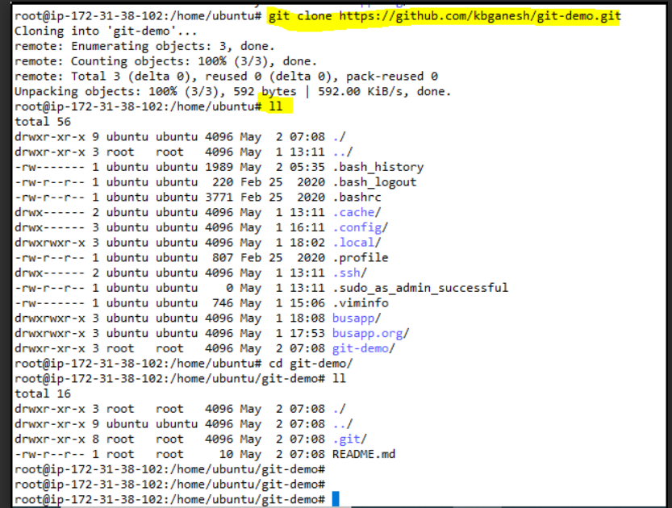

# What is Remote Repo:

Git is a command line but github is a web based technology. List of web based repository providers : github, bitbucket, gitlab. The most popuar is github because it is microsoft project.

Everyone pull a repo from remote repository and work and then they push into the remote repo after completes a work.

Refer the Link:


# How to create a repository in GitHub:

1.Login your account, On left top we have option to create a repository.

2.Choose public option and then add readme file option and then choose setting edit the main master into master.

3.Click create repository.

4.Go to the Repository setting and invite the collaborator, So once we invite the collaborator they can edit and manage our repository.

# Interact and Work With Remote Repo:

Command to clone from remote to our local :

```
git clone <URL>
```

Refer the Link:




During the clone time it doesn’t ask any password for our repo because it is a public repository anyone can download and use it.

After clone the repository we need to add some files and then going to update our remote repository.

Update the remote Repo: To update the remote repository we require the access token, So we need create a token from github site, GO to the profile, Developer setting and Generate an access token and use it.

Command to update the remote Repo:

```
git push origin master
```

Command to update local repo from remote Repo:

```
git pull -r
```

To find out the Remote Repo details:

```
git remote -v
```

Refer the link:


Some of companies or production environment managing two Repo’s one is for live, So users are fetch the data from live repo after complete the work, They upload the files into another repo(Which mean they push the files into another repo during the time, We need to change the push origin )

Command to set the remote repository push origin:

```
git remote set-url --push origin <URL>
```

To change the remote repo,Just use command only no need mention the --push : 

```
git remote set-url origin <URL>
```

# How to move local Repo to Remote Repo(Github):

Step 1:

Create a dir in your local machine and commit some files: "mkdir git-pc" "cd git-pc" "touch 1 2 3"   "git init ."  "git add 1 2 3" "git commit -m “New file"

Step 2: 

Create a Repo in github page, During the creation time, Do not select the option readme those steps because we are going push the existing local repo.

Step 3: 

"git remote add origin <URL>"( Which created in github) Check the branch using the command: "git branch" (If it is a master means leave it, Other than the master please change it use the command) "git branch -M master" "git push -u origin master" (To push our codes)
