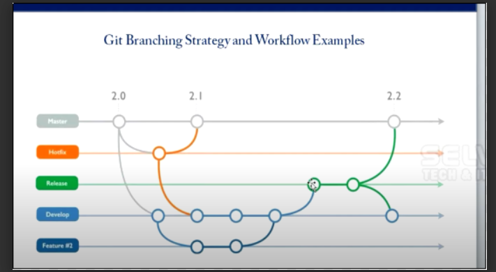

# What is Branching:

Branching is a something useful method to create different folders and access different teams. Which mainly used for workflow and we can easily merge codes from different stages.

Refer the link:



A company usually maintains three branches : Develop, QA and Hot fix.

Before We are going to work with any repository need to pull our repo: 

```
git pull -r
```

# Command to view the current branch : 

```
git branch -a
```

# Command to list all branches:

```
git branch
```
# Comand to create a new branch : 

```
git branch develop
```
We cannot see the develop folder physically but it will create you may cross check by run the command : "git branch"

Refer the link:


# Command to Switch branch:

Master to Develop

```
git checkout develop
```

# Command to create a new branch and switch:

```
git checkout -b qa
```
Note:qa is the branch name.

Again Switche from qa to develop using git checkout and created file using touch and make some changes the contents which already there.

After edit the file run the add and commit commands : "git add ."  "git commit -m “New changes for develop”"

Then double check the master branch whether new files are there or not which created in develop, it shouldn’t  because it is different branch.

# Git Merging:

Then checkout(Switch) to qa branch and merge from develop :

```
git checkout qa
git merge develop qa
```

Note : Always make sure to run the command from new branch, Here you should run from qa after checkout from develop.

Then check out from qa to master and merge it.

```
git checkout master
git merge qa master
```

# Command to delete a branch:

```
git branch -d qa
```

